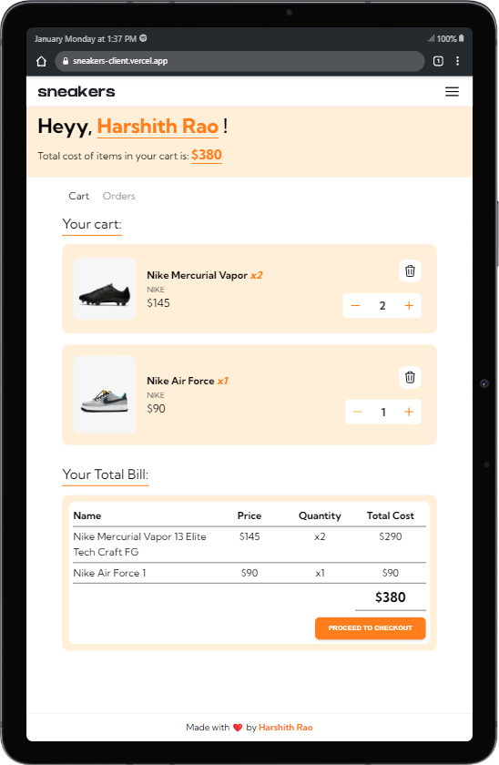

# SNEAKERS


Get ready to dive into the fascinating world of sneakers. From the latest trends to classic styles, we've got you covered. Whether you're an avid collector or just looking for a comfortable pair of shoes, we'll help you choose the best sneakers for your needs.


## Tech Stack

**Client:** React, React-Router, TailwindCSS, Material-Tailwind

**Server:** Node, Express, MongoDB, Stripe


## How to run locally

**Clone the repository:** 
```bash
git clone https://github.com/harshithrao07/sneakers.git 
```
**Navigate to both Client and Server** 
```bash
cd client 
```
```bash
cd server
```
**Install dependencies:** 
```bash
npm install 
```
**Run the application:** 
```bash
npm run dev
```
## Features

**-Technology Stack:** \
Utilize React, React Router, Tailwind CSS, Material-Tailwind, Node.js, Express, MongoDB, Axios, JWT, and Stripe for a modern and robust e-commerce website.

**-Responsive Design:** \
Ensure a responsive web design for optimal user experience across devices.

**-Advanced Product Filtering:** \
Enhance product filtering for brands, categories, and sneaker types, streamlining user searches.

**-Order Tracking:** \
Implement a system for users to track orders in real-time, enhancing transparency.

**Secure Payments with Stripe:** \
Implement secure payment processing using Stripe, ensuring a seamless and trustworthy transaction experience for users.


## Screenshots





## Authors

- [Github](https://www.github.com/harshithrao07)
- [Linkedin](https://www.linkedin.com/in/harshithrao07/)
- [Portfolio](https://harshithrao.vercel.app/)
- [Instagram](https://www.instagram.com/harshith._.rao/)
